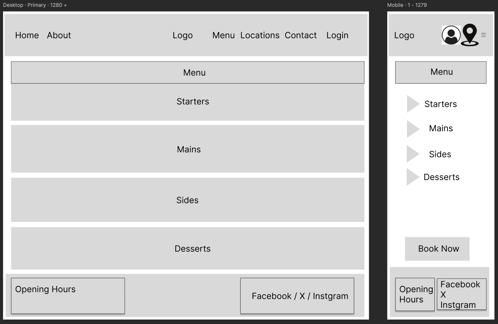
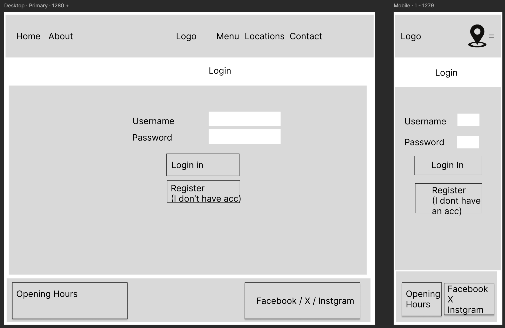
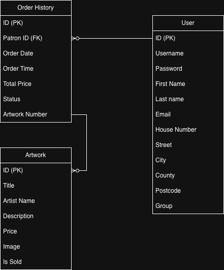
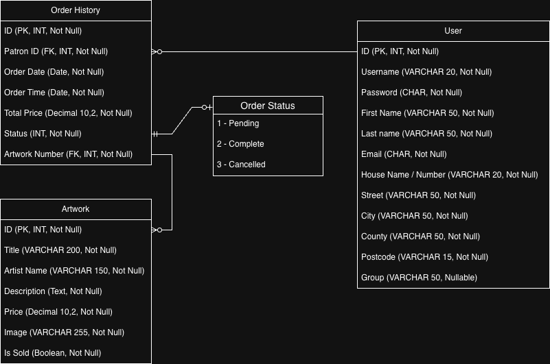

# Brushed Up Things! - An independent Art Gallery Catalog. 

## Table of Contents:

1. [About](#about)
2. [Business Goals](#business-goals)
3. [User Stories & Acceptance Criteria ](#user-stories-and-acceptance-criteria)
4. [Wireframes](#wireframes)
5. [Entity Relationship Diagrams](#entity-relationship-diagrams)
6. [Design and How to use the website](#design-and-how-to-use-the-website)
7. [Agile Methodology Followed](#agile-methodology-followed)
8. [Languages and Technologies used](#languages-and-technologies-used)
9. [Links Used](#links-used)
10. [Media Used](#media-used)
11. [LightHouse Accessibility Checks](#lighthouse-accessibility-checks)
12. [HTML Validation Checks](#html-validation-checks)
13. [CSS Validation Checks and Explanation of Results](#css-validation-checks)
14. [Python Validation Checks and Explanation of Results](#python-validation-check)
15. [Fixed](#fixed)
16. [Manual Testing of the website](#manual-testing)
17. [Responsiveness](#responsive-testing)
18. [Final Product](#final-product)
19. [Mobile Screen Views](#mobile-screen-views)
20. [Business Goals and User Stories met](#business-goals-and-user-stories-met)
21. [Deployment](#deployment)
22. [Bug Fixes](#bug-fixes)
23. [Project Constraints or Limitations](#project-constraints-or-limitations)
24. [References](#references)
25. [Acknowledgements](#acknowledgements)
26. [Thank You](#thank-you-for-reviewing-this-product)

## About
Brushed Up Things! - This is a catolog showcasing artworks by our independent artists.  Art collectors and enthusiasts can review the items of our gallery and make purchases. Making purchases, involves the user first registering and creating an account then loggin in to make a purchase. 

## Business Goals: 
1. Provide an online platform that allows the exhibitions of our independent artists.
2. Allow purchases to be done online only for this online art gallery store. 
3. Deliver a browsing experience whereby once an item is sold the item is updated as sold once the item is purchased online. 
4. Create an online awareness of the store by using Search Engine Optimizations. 

## User Stories & Acceptance Criteria:

1. Viewing the Artwork Catalog

User Story: As a user, I can view the varioua artwork with descriptions, prices so that I can decide if I would like to purchase any artwork. 

Acceptance Criteria: 
- There must be an art gallery page which are available to all users (registered, not registered, logged-in, not logged-in)
- Each art piece must have a title, artist name, description, price. 

2. Account Registration for Purchasing

User Story: As a user, I can register for an account and log in so that I can have a safe means of purchasing items from the catalog (which is online only). 

Acceptance Criteria: 
- All users must first register to have their own account. Only after having an account, users can log in to make a purchase for the desired item(s). 
- Non-registered users or persons who are not logged-in will be directed to the register / log in page. 

3. Instant Updates on Sold Art Pieces

User Story: As a user or site owner, I can know when at art piece has been bought so that I know that it is no longer available for purchase. 

Acceptance Criteria: 
- Once an item is bought and payment is successfully made via the payment portal, the item in the database must be updated as "Sold" and no longer available to buy. 
- The catalog item on the gallery page must show as "Sold". and the purchase feature must be disabled. 

4. Managing Past Orders (Profile Page)

User Story: As a user, I can view my profile so that i can see a record of all the items that I have purchased. 

Acceptance Criteria: 
- A secure user profile area  should be accessible to the only the authenticated user who owns it. 
- The profile page should retrieve and sho a summary of all past transactions. 

5. Store Management: 

User Story: As a gallery manager, I can add, update, delete items from the gallery so that i dont have to go to the developer if there are changes in the gallery pieces(which there will be frequently).

Acceptance Criteria: 
- Only authenticated staff such as the gallery manager, can change gallery inventory (such as add, update, delete) on the website. 
- A Form should be available that allows the authenticated staff/manager to perform the processes above. 

## Wireframes:

1. Home Page for mobiles, tablets, laptops and PC:
   

2. Menu Page for mobiles, tablets, laptops and PC:
   

3. Log In Page for mobiles, tablets, laptops and PC:
   

4. Contact Us page for mobiles, tablets, laptops and PC:
   

5. Register page for mobiles, tablets, laptops and PC:
   

6. Bookings Page for mobiles, tablets, laptops and PC:
   

## Entity Relationship Diagrams:

1. Logical Data Model (ERD):

    

2. Physical Data Model (ERD):

     

## Languages and Technologies used:

1. HTML
2. CSS
3. Python Validation (PEP 8)
4. Python 
5. Django framework 
6. Bootstrap version 5.3.3 Library - for navigation bar, footer and other body elements and class implementation for styling .
7. Font Awesome library for icons
8. Bootstrap5 icon library for icons
8. Google Fonts to import additional fonts
9. Artificial Intelligence Technologies (Gemini) was used to create Brushed Up Things Logo, the favicons of various sizes as well as art pieces for all the sculptures and all the oil paintings.
10. Chrome developer tools, Inspector, to get screenshots of the product webpage on various sized devices.
11. LightHouse on Chrome Developer Tools to check for Accessibility.
12. Nu HTML Validator to check the HTML code.
13. W3C CSS Validator to check the CSS code.
14. Amazon Web Services for the AWS database - Postgres
15. Figma software was used to create the wireframes.
16. draw.io for Entity Relationship Diagrams (ERD).

## Links used:

- External links include the social media links below:

1. Facebook:
   [Facebook](https://www.facebook.com)

2. Instagram:
   [Instagram](https://www.instagram.com)

3. X (formerly known as Twitter):
   [X](https://www.twitter.com)

   ## References: 
   1. Unsplash Royalty Free Images - Mayur Deshpande
   2. Unsplash Royalty Free Images - Europeana
   3. Unsplash Royalty Free Images - Vineet Pathak
   4. Unsplash Royalty Free Images - Europeana
   5. Unsplash Royalty Free Images - Faith Washere
   6. Unsplash Royalty Free Images - Boston Public Library
